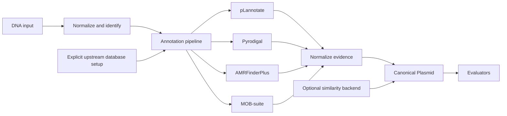

# Architecture

This page explains the public shape of Plasmid Oracle: what the package
promises, where each responsibility lives, and which boundaries keep annotation,
execution, and evaluation separate.

## Product Contract

Plasmid Oracle accepts plasmid DNA and produces a canonical, evidence-backed
`Plasmid` object.

The core must answer:

1. What sequence was analyzed?
2. What annotations were detected?
3. What plasmid-level properties can be characterized?
4. Which tools and databases produced each claim?
5. Which analyses failed, were skipped, or remain unknown?

Requirement evaluation is a consumer of this object. It is not part of the
annotation engine and must not need to parse raw tool output.

## Scope

### Initial scope

- Engineered and bacterial plasmid DNA.
- Raw sequence input through Python and single-record FASTA input through CLI.
- Strict normalization with topology and sequence identity.
- Circular-aware normalized annotations.
- Stable evidence IDs for every serialized evidence fact.
- Provider capability declarations with explicit absence semantics.
- pLannotate, Pyrodigal, AMRFinderPlus, and MOB-suite providers.
- Explicit upstream database installation and version capture.
- Synchronous and asynchronous Python APIs.
- Resumable JSONL batch API and CLI.
- Deterministic evidence resolution with explicit conflicts.
- Opt-in content-addressed caching.
- Bounded provider concurrency within a total thread budget.
- Execution manifests with explicit partial-run status.
- JSON-compatible serialization.

### Fast follow

- Whole-plasmid similarity against a local or remote comparison database.
- Evaluation of structured propagation and selection requirements.
- Natural-language conversion into structured requirements.

### Out of scope for the annotation core

- A universal `is_viable` Boolean.
- LLM interpretation of raw DNA.
- A graph database or comprehensive molecular biology ontology.
- GenBank export.
- A mandatory web service.
- Nextflow as an in-process Python dependency.

## User Experience

The primary import is:

```python
import plasmid_oracle as po
```

The primary annotation entry point is:

```python
plasmid = po.annotate(
    seq="ATGC...",
    topology="circular",
    mode="standard",
)
```

A normalized object can also be created without analysis:

```python
plasmid = po.plasmid(seq="ATGC...", topology="circular")
```

The asynchronous companion is explicit:

```python
plasmid = await po.annotate_async(seq="ATGC...", mode="standard")
```

Model instances do not launch subprocesses. All computation enters through the
pipeline API, which keeps immutable data separate from execution.

## System Context



The architecture has five layers:

1. Domain model: immutable biological and provenance types.
2. Provider adapters: translate one tool into normalized evidence.
3. Execution services: process control and explicit database setup.
4. Pipeline: select and coordinate providers, then assemble a `Plasmid`.
5. Evaluation: apply typed requirements to an existing `Plasmid`.

Dependencies point inward. Domain types do not import tool adapters.

## Canonical Domain Model

### `SequenceInfo`

- normalized uppercase IUPAC DNA;
- topology: `linear` or `circular`;
- length;
- GC fraction;
- ambiguous base count;
- SHA-256 checksum of the normalized sequence;
- rotation and reverse-complement invariant checksum;
- validation warnings.

Whitespace is ignored. Other invalid characters are rejected rather than
silently deleted. Coordinates always refer to the normalized sequence.

The normal checksum identifies an exact representation. The canonical checksum
identifies the same circular molecule independent of origin choice or strand.

### Coordinate convention

Coordinates are zero-based and half-open.

A linear location has one span:

```text
[start, end)
```

A feature crossing the origin of a circular sequence has two spans in biological
order:

```text
[start, sequence_length), [0, end)
```

Wrapped coordinates are never represented as an unbounded `end` greater than
the sequence length.

### `Annotation`

- stable result-local annotation ID and stable content-addressed evidence ID;
- feature type and display name;
- canonical identifiers where known;
- normalized biological concepts and structured sequence variants;
- circular-aware location and strand;
- integrity: complete, partial, interrupted, ambiguous, or unknown;
- nucleotide or protein sequence when useful;
- source provider, tool version, database, and database version;
- evidence metrics such as identity, coverage, score, and e-value;
- provider-specific qualifiers that survived normalization.

An annotation is a normalized evidence call. Conflicting calls may coexist.
Resolution must not discard the evidence that produced a decision.

### `Characterization`

- replicon calls;
- relaxase calls;
- oriT calls;
- predicted mobility;
- predicted host range;
- quality flags;
- optional whole-plasmid similarity hits.

These are plasmid-level conclusions rather than arbitrary key-value
properties. Each call carries provenance, a stable evidence ID, normalized
concepts where available, or points to supporting annotations.

### `AnalysisManifest`

- pipeline version and selected mode;
- normalized pipeline parameters;
- provider runs in deterministic order;
- provider and tool versions;
- database identities and reported versions;
- database manifest digests;
- provider capability declarations and absence semantics;
- status: completed, failed, skipped, unavailable, or cached;
- runtime and warnings for each provider.

A missing provider is visible in the manifest. Absence of an annotation is
treated as unknown unless a completed provider explicitly declares
`bounded_catalog` or `exhaustive` absence semantics for the evaluated concept.

### `Plasmid`

```text
Plasmid
  sequence: SequenceInfo
  evidence: tuple[Annotation, ...]
  annotations: tuple[ResolvedAnnotation, ...]
  characterization: Characterization
  source_metadata: immutable mapping
  analysis: AnalysisManifest
```

The object is immutable. Running more analysis returns a new object.

## Provider Boundary

Providers implement a small protocol:

```python
class AnnotationProvider(Protocol):
    spec: ProviderSpec

    def run(
        self,
        sequence: SequenceInfo,
        context: ProviderContext,
    ) -> ProviderResult: ...
```

`ProviderSpec` declares:

- stable provider name;
- implementation version;
- the modes in which it participates;
- the biological concepts it can detect and what a no-hit result means.

Provider-specific construction and `diagnose()` report executable, database,
version readiness, capability declarations, and database manifest identities.
Resource classes and richer dependency declarations can be added to
`ProviderSpec` when parallel scheduling requires them.

`ProviderResult` contains normalized annotations, characterization calls,
warnings, and execution metadata. It does not return a Pandas DataFrame as the
inter-provider contract. A pLannotate adapter may consume its DataFrame
internally.

Initial providers:

| Provider | Execution | Responsibility |
| --- | --- | --- |
| pLannotate | in-process where stable | Engineered parts, protein and RNA evidence |
| Pyrodigal | in-process | ORF discovery and translated sequences |
| AMRFinderPlus | controlled CLI | AMR gene and allele evidence |
| MOB-suite | controlled CLI | Replicons, relaxases, oriT, mobility and host range |

The current alpha does not include a native signature database. Adding one
would require a separately reviewed data license, provenance manifest, and
biological benchmark before it could become a default provider.

## Pipeline

Pipeline stages are:

1. Normalize and validate sequence.
2. Resolve a mode into an explicit provider plan.
3. Verify provider executables and databases.
4. Run providers in deterministic order with bounded subprocesses.
5. Parse and validate each provider result.
6. Merge normalized annotations and plasmid-level characterization.
7. Assemble and return the immutable `Plasmid`.

Provider-result caching, bounded parallel scheduling, cross-provider evidence
resolution, and resumable JSONL batch execution are implemented. Caching is
opt-in for single-plasmid annotation and enabled by default for batch runs.
Cache hits remain explicit in the manifest.

Modes are versioned configurations:

```text
minimal  = sequence checks + Pyrodigal
fast     = compatibility alias for minimal
standard = pLannotate + Pyrodigal + AMRFinderPlus + MOB-suite
deep     = standard (reserved for future broader and similarity searches)
```

Callers may supply an explicit provider list for testing or advanced use.

### Failure behavior

The default is strict for requested providers: a provider failure raises a
typed pipeline exception containing the partial manifest.

An explicit tolerant policy may return a partial `Plasmid`, but failed or
unavailable providers remain visible in the manifest. Evaluation must inspect
provider completeness before making absence-based claims.

## Process Execution

Direct Python orchestration is the library default. The JSONL batch API and CLI
wrap the same single-plasmid pipeline with record-level concurrency, durable
terminal records, content-addressed provider caching, and a final batch
manifest.

In-process APIs are preferred when they are stable and isolate global state.
CLI-only tools use one controlled runner with:

- argument arrays and `shell=False`;
- private temporary directories;
- captured standard output and standard error;
- timeouts and process-group termination;
- explicit environment variables;
- executable and database version capture;
- explicit provider thread counts;
- structured errors with no silent fallback.

The pipeline can run providers concurrently. `threads` is a total CPU budget
divided across up to `provider_workers` active providers, preventing each tool
from independently consuming the full caller budget. Sequential execution
remains the default.

## Database Lifecycle

The wheel contains the canonical schemas and code. Source distributions and
the repository contain tiny recorded test fixtures.

The wheel does not contain large pLannotate, AMRFinderPlus, MOB-suite, or
comparison databases.

The public setup workflow delegates to each provider's supported, explicit
installer:

```python
po.setup("plannotate")
po.setup("amrfinderplus")
po.setup("mob_suite", mob_database_dir=Path("/data/mob-suite"))
```

Plasmid Oracle does not claim stronger integrity or atomicity than an upstream
installer provides. pLannotate verifies its published archive checksum;
AMRFinderPlus and MOB-suite manage their own database installation formats.
Provider preflight captures the database versions exposed by those tools.

No large download occurs merely because `plasmid_oracle` was imported or
because `annotate()` was called. `setup()` is the only download-triggering
Plasmid Oracle API.

## Caching

Provider results are content-addressed by:

```text
exact sequence checksum
topology
provider implementation and tool version
provider parameters
database pack IDs and checksums
normalization schema version
```

The rotation-invariant checksum is useful for identifying equivalent circular
plasmids, but provider cache keys use the exact checksum unless provider output
coordinates are explicitly remapped.

Cache entries must be written atomically and validated on read. A corrupt or
schema-incompatible entry will be ignored and reported, not partially consumed.

## Evidence Resolution

The current resolver preserves all normalized calls in deterministic provider
order and conservatively:

- normalize feature type names and coordinates;
- retain provider provenance;
- group highly overlapping compatible calls;
- require coding calls to share an identity signal before grouping;
- prefer specific identified features over anonymous ORFs for presentation;
- retain the anonymous ORF as supporting or conflicting evidence;
- distinguish full, partial, interrupted, and ambiguous calls;
- emits typed conflicts for unresolved strand, coordinate, and integrity
  disagreements;
- absorbs contained partial origin fragments into complete calls without
  discarding either evidence record.

Resolution rules are deterministic, versioned, and independently tested. They
do not infer biological capabilities such as antibiotic compatibility. That
belongs in later evaluation.

Coding-feature grouping is deliberately stricter than plain reciprocal overlap.
Compatible calls must share canonical IDs, compatible specific names, exact or
contained sequences, normalized concepts, or structured sequence variants.
Anonymous ORFs therefore cannot bridge two different named overlapping genes
into one resolved feature.

## Evaluation Boundary

Evaluators consume an existing `Plasmid`:

```python
report = po.evaluate(
    plasmid,
    requirements={
        "host": "E. coli",
        "selection": {"antibiotic": "ampicillin"},
        "copy_number": "high",
    },
)
```

An evaluator produces pass, fail, warning, or unknown findings with exact
evidence. It separates three concepts:

- **validity**: whether the sequence is coherent enough to interpret as plasmid
  DNA, without requiring a standard lab-vector backbone;
- **utility**: whether the plasmid satisfies a named preset such as
  `lab_vector` or `bacterial_expression_vector`;
- **fidelity**: whether the plasmid matches a parsed requirement set from a user
  prompt.

Natural language is first converted into a structured requirement form. The
requirement schema is generated from Plasmid Oracle's registered presets and
checks, then deterministic code performs the biological checks. The LLM layer
does not inspect raw DNA and does not decide pass/fail status.

## Package Layout

```text
src/plasmid_oracle/
  __init__.py
  api.py
  errors.py
  evaluation.py
  reporting.py
  resolution.py
  model/
    sequence.py
    location.py
    annotation.py
    characterization.py
    evaluation.py
    manifest.py
    plasmid.py
    resolution.py
  execution/
    process.py
  pipeline/
    provider.py
    runner.py
    diagnostics.py
    cache.py
  providers/
    pyrodigal.py
    plannotate.py
    amrfinder.py
    mob_typer.py
  databases/
    setup.py
  serialization/
    json.py
```

Only modules justified by a tested implementation slice should be created.
This layout is a boundary map, not a requirement to scaffold empty files.

## Test Strategy

Development uses red-green-refactor.

### Domain tests

- strict normalization and IUPAC handling;
- exact and rotation-invariant checksums;
- reverse-complement invariance;
- linear and circular location validation;
- immutability and serialization;
- deterministic ordering.

### Provider contract tests

Every provider must pass shared tests for:

- normalized coordinates and strands;
- complete provenance;
- empty valid output;
- malformed tool output;
- missing executable or database;
- timeout and cancellation;
- deterministic result parsing.

Provider unit tests use small recorded outputs and do not require databases.
Separate integration tests run real tools against pinned fixtures.

### Biological benchmark tests

- manually reviewed engineered plasmids;
- known AMR and replicon controls;
- rotated and reverse-complemented equivalents;
- deleted, truncated, frameshifted, and duplicated components;
- circular-boundary features;
- expected negative controls.

Benchmark assertions emphasize identity, coverage, integrity, and calibrated
false-positive behavior rather than only feature overlap.

## Delivery Slices

### Slice 1: canonical core (implemented)

- project configuration;
- sequence normalization and checksums;
- circular locations;
- immutable annotation, characterization, manifest, and plasmid models;
- provider protocol;
- pipeline with injected test providers.

### Slice 2: minimal mode (implemented)

- Pyrodigal provider;
- provider contract and circular-coordinate tests.

### Slice 3: standard providers (implemented)

- pLannotate adapter;
- AMRFinderPlus adapter;
- MOB-suite adapter;
- setup and diagnostic commands;
- controlled process runner.

### Slice 4: serialization and resolution

- versioned JSON-compatible output (implemented);
- strict and tolerant partial-analysis behavior (implemented);
- deterministic cross-provider evidence resolver (implemented);
- quality-flag derivation (planned).

### Slice 5: execution ergonomics (implemented)

- content-addressed provider cache;
- total thread budgeting and bounded provider concurrency;
- asynchronous Python entry point;
- readable reports, query helpers, and DataFrame conversion;
- real-tool rotation, reverse-complement, and deletion controls.

### Slice 6: first evaluation

- structured propagation and selection requirements;
- evidence-completeness checks;
- pass, fail, warning, and unknown findings.

## Decisions To Validate With Benchmarks

- Whether the native signature provider earns a place in `fast` mode.
- Whether pLannotate and Pyrodigal produce enough duplicate ORFs to justify
  running both by default.
- Which MOB-suite outputs are stable enough to normalize as host-range claims.
- Default CPU limits and latency targets.
- The smallest core database pack that provides useful offline behavior.
- Whether `standard` should be the eventual default or an explicit opt-in after
  setup.
